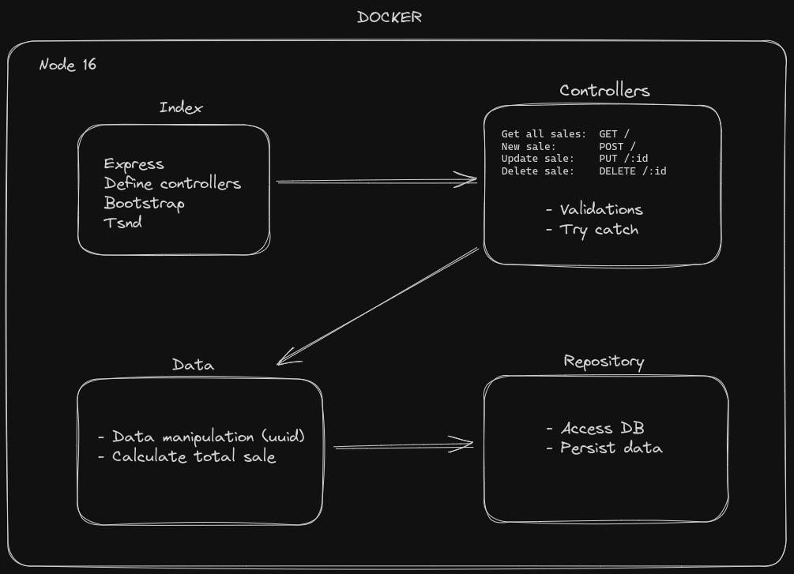

# Debugger com Node e VS Code
Este repositório contém recursos relacionados à palestra sobre como utilizar o debugger com o Visual Studio Code (VSCode) para aprimorar o processo de debug em aplicações Node.js. A palestra aborda técnicas e dicas para realizar debug de forma mais profissional e eficiente, utilizando as funcionalidades oferecidas pelo VSCode.

## Recursos Incluídos
Slides da palestra em formato PDF [disponível aqui](https://docs.google.com/presentation/d/1o-rU4krag3WTnCk022Zr0qFF-73USLGqNv8JRz2Wrj8/edit?usp=sharing).
Exemplos de código utilizados durante a palestra, localizados na pasta ```/src```.
Instruções para configurar o ambiente de debug utilizando o VSCode, disponíveis no arquivo CONFIGURATION.md.
Links para recursos externos, referências e documentação relevante.

## Tópicos Abordados
Durante a palestra, foram explorados os seguintes tópicos:

- Introdução ao processo de debug e sua importância no desenvolvimento de aplicações.
- Visão geral das funcionalidades do VSCode relacionadas ao debugger.
- Configuração de breakpoints para interromper a execução do código em pontos específicos.
- Utilização do painel de variáveis e watches para monitorar valores durante a depuração.
- Uso do console integrado para executar comandos durante a depuração.
- Inspeção de pilha de chamadas para entender a sequência de execução do código.
- Debugging de aplicações Node.js, incluindo a configuração do ambiente e execução de scripts.
- Dicas avançadas e práticas recomendadas para um processo de debugging mais eficiente.

## Como Utilizar Este Repositório
Se você esteve presente na palestra ou está interessado em aprender mais sobre debugging com o - VSCode, este repositório pode ser utilizado da seguinte maneira:
Explore os exemplos de código na pasta exemplos para entender como aplicar as técnicas de debugging apresentadas.
Consulte as instruções de configuração no arquivo CONFIGURATION.md para preparar seu ambiente de desenvolvimento para debugging com o VSCode.
Utilize os slides disponíveis em slides/slides.pdf para revisar o conteúdo abordado durante a palestra.
## Recursos Adicionais
Além dos recursos incluídos neste repositório, você pode encontrar mais informações sobre debugging com o VSCode e Node.js nos seguintes links:

- [Documentação oficial do Visual Studio Code.](https://code.visualstudio.com/docs/editor/debugging)
- [Documentação oficial do Node.js.](https://nodejs.org/api/debugger.html)

## Arquitetura
